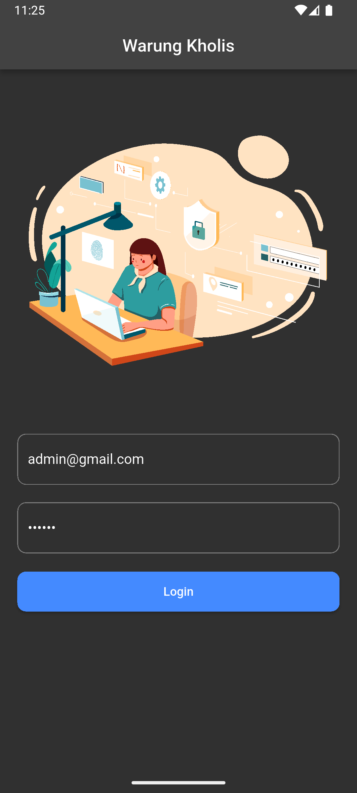
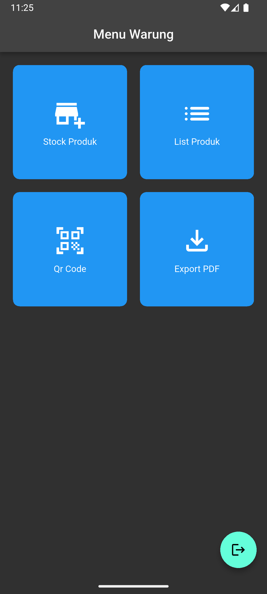
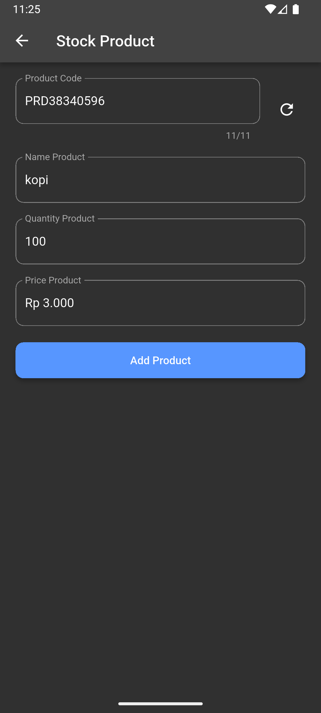
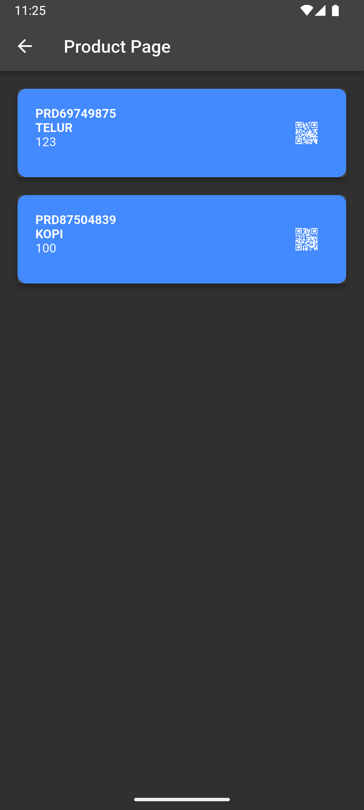
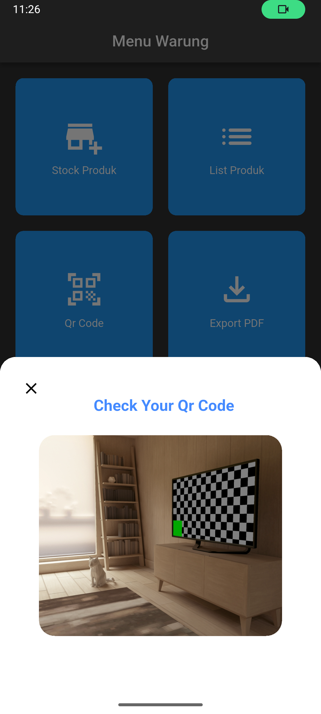
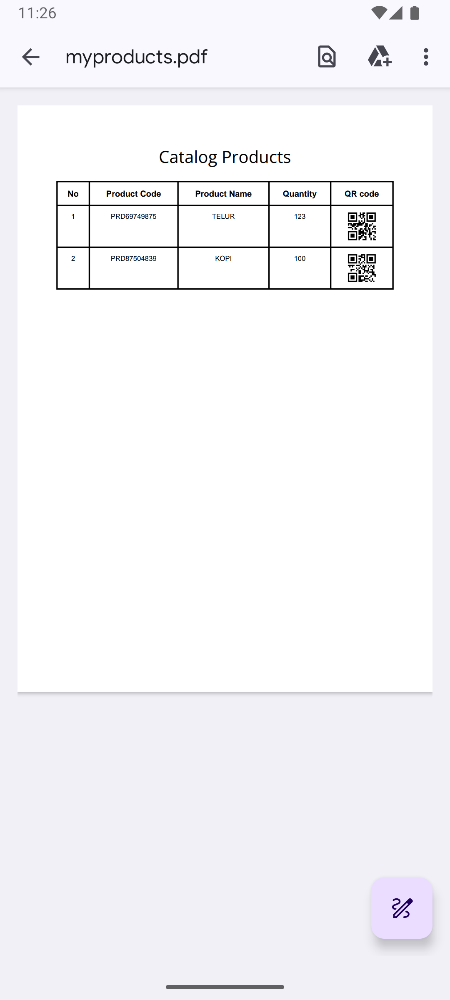

# 🏠 Warung Kholis Apps 

| Flutter | Firebase |
|---------|----------|
| [](https://flutter.dev) | [](https://firebase.google.com) |


Aplikasi ini dibuat untuk mempermudah proses peng-stock-an barang agar menjadi lebih cepat dan efisien.
Aplikasi ini juga membantu pemilik warung dalam memantau ketersediaan produk.
Dengan tampilan yang sederhana, pengguna dapat mengelola data barang tanpa ribet.
Setiap perubahan data tersimpan otomatis sehingga meminimalkan kesalahan pencatatan.
Aplikasi ini diharapkan dapat mendukung operasional warung menjadi lebih tertata dan modern.

## 📸 Screenshots

| Login | Home |
|-------|-------|
|  |  |

| Stock | View Product |
|--------|--------------|
|  |  |

| Scan QR | PDF |
|---------|------|
|  |  |


## 🛠 Cara Menjalankan Project

### **1. Clone Repository**
```
git clone <repo-url>
```


### **2. Setup Flutter**
```
cd <repo>
flutter pub get
flutter run
```
> ⚠️ **Noted**  
> Pastikan Anda telah menginstall **Node.js** dan melakukan **Firebase setup** agar file **firebase_options.dart** dapat dibuat melalui perintah konfigurasi Firebase.


---

## 📱 Fitur Aplikasi

- CRUD Barang — Tambah, edit, hapus, dan lihat detail barang dengan mudah.  
- Tambah Barang Cepat — Input barang baru secara praktis dan efisien.
- QR Code Scanner — Scan barcode/QR untuk mencari atau menampilkan data barang secara instan.
- Generate PDF — Cetak atau ekspor data barang ke dalam format PDF.
- Manajemen Stok — Memantau jumlah stok barang secara real-time.
 
 
